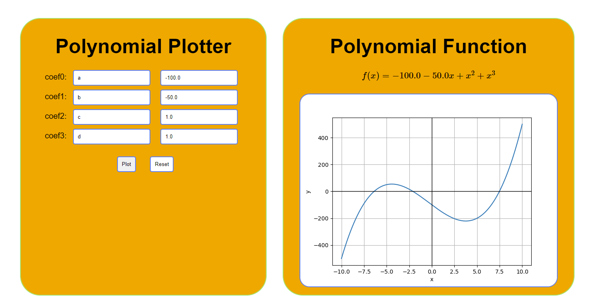

# Polynomial Plotter

This is a simple Flask app that plots a polynomial with coefficients a, b, c, and d. The user can input their own 
values for the coefficients and the app will generate a plot of the corresponding polynomial. The primary purpose 
for this app is to demonstrate how to use Flask to create a web app and use this code as a template for a different 
project.

## Requirements

This app requires Python 3 and the following packages:

- Flask
- SymPy
- NumPy
- Matplotlib

## Installation

1. Clone the repository:
    
    ```
    git clone <https://github.com/dleon86/polynomial_plotter.git>
    
    ```
    
2. Install the required packages:
    
    ```
    pip install -r requirements.txt
    
    ```
    
3. Run the app:
    
    ```
    python app.py
    
    ```
    
4. Open [http://localhost:5000](http://localhost:5000/) in your browser to use the app.

## Usage

The app displays a form where the user can input their own values for the coefficients of the polynomial. The app will generate a plot of the corresponding polynomial, as well as the LaTeX expression for the polynomial.

The user can also reset the coefficients to their default values by clicking the "Reset" button.

## License

This project is licensed under the MIT License - see the LICENSE file for details.